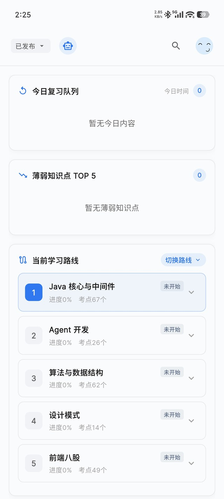
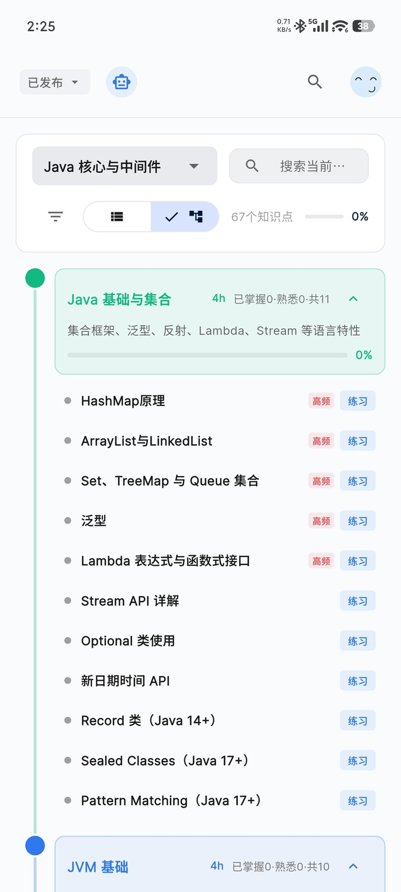
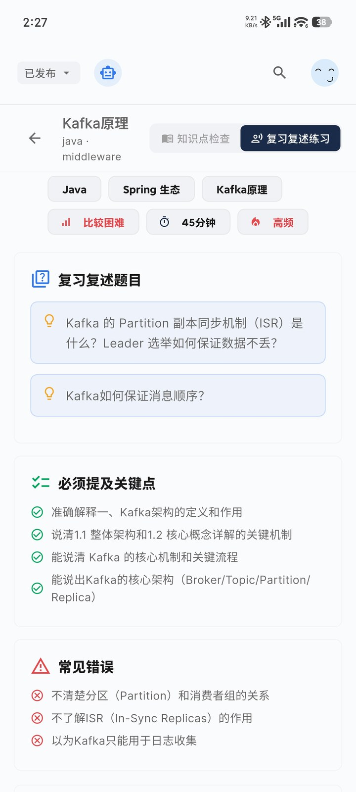
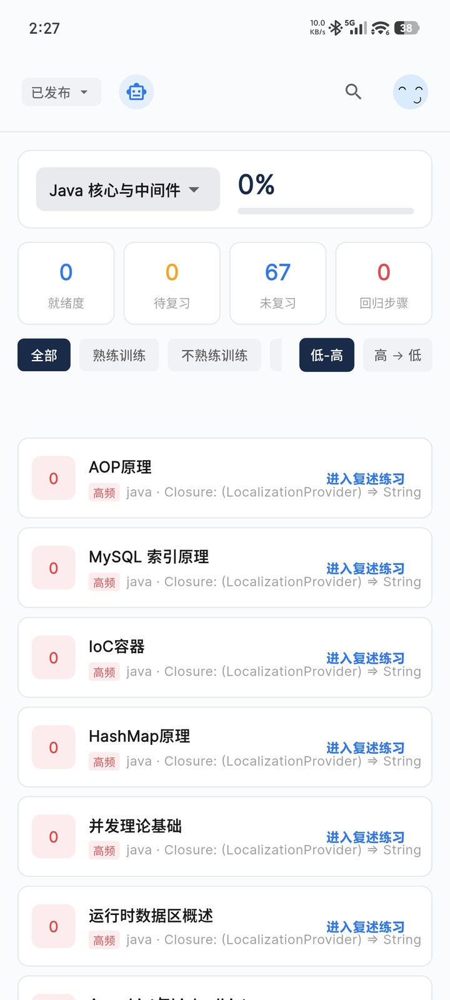
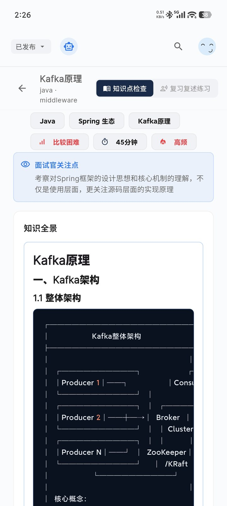
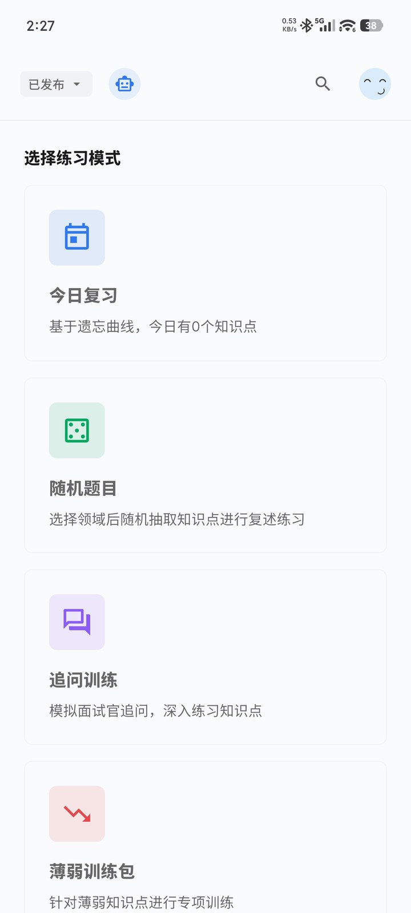
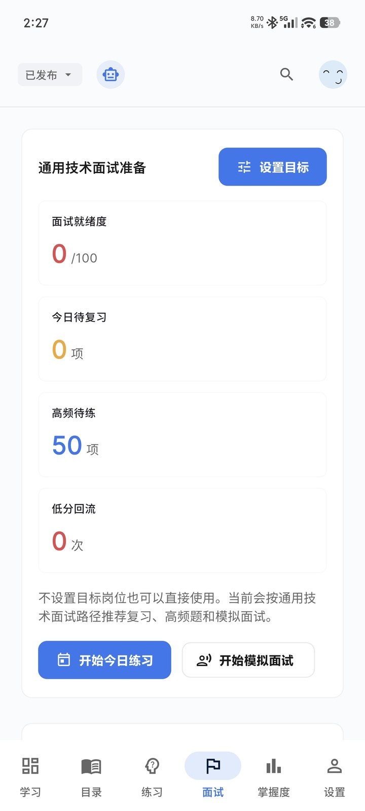
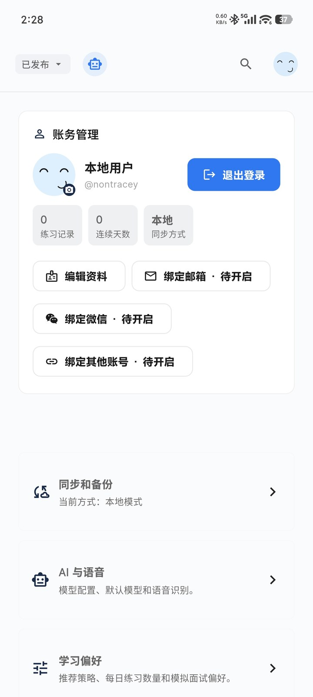

# 面试智练

[](https://github.com/nontracey/mianshi-zhilian-app/actions/workflows/ci.yml)
[](LICENSE)

面试智练是一款本地优先的技术面试主动回忆学习工作台，通过「知识学习 -> 主动复述 -> AI 评估纠错 -> 掌握度回流」帮助你把看过的知识真正说清楚。

你可以直接使用 Web 版，也可以下载 Android、macOS、Windows 客户端。游客即可使用核心学习和练习功能，AI 模型由你自己配置，API Key 默认保存在本地。

| 入口 | 链接 |
| --- | --- |
| 官网 | https://mianshizhilian.nontracey.de5.net |
| Web App | https://mianshizhilian-app.nontracey.de5.net |
| 备用 Web App | https://mianshi-zhilian-app.pages.dev |
| 下载客户端 | https://github.com/nontracey/mianshi-zhilian-app/releases |
| 隐私政策 | [docs/privacy-policy.md](./docs/privacy-policy.md) |
| 支持项目 | [docs/sponsor.md](./docs/sponsor.md) |

## 界面预览

| 学习中心 | 知识目录 | 复述练习 | 掌握度 |
| --- | --- | --- | --- |
|  |  |  |  |

| 知识详情 | 练习模式 | 面试准备 | 个人中心 |
| --- | --- | --- | --- |
|  |  |  |  |

## 它解决什么问题

很多面试准备停留在「看过」和「刷过」，真正上场时却说不完整、说不深入、经不起追问。面试智练把准备过程拆成四步：

1. 按知识路线学习和复习技术面试题。
2. 用文字、语音、图片或代码主动复述答案。
3. 让 AI 评估遗漏点、错误点、表达质量和优化答案。
4. 把评估结果回流到掌握度、今日复习和薄弱训练。

## 核心功能

- **结构化知识路线**：覆盖 Java、算法、前端、Agent、.NET、架构、设计模式、操作系统、网络等领域。
- **主动复述练习**：支持复述题目、关键点、常见错误、语音输入和 AI 深度评估。
- **8 种练习模式**：今日复习、随机抽题、追问训练、薄弱训练、高频冲刺、项目深挖、系统设计、模拟面试。
- **掌握度系统**：按领域、熟练度、逾期状态和薄弱点决定下一轮练什么。
- **面试准备工作台**：设置目标岗位和面试日期，解析 JD，维护项目库和回答版本。
- **多模型配置**：支持多个兼容 OpenAI API 格式的 AI 服务配置，未配置时可继续本地练习。
- **本地优先与同步**：学习数据默认本地保存，可选文件、WebDAV、GitHub、Gitee 同步。
- **多平台分发**：Flutter Web、Android、macOS、Windows，GitHub Releases 提供安装包和更新清单。

## 快速开始

### 直接使用

打开 [Web App](https://mianshi-zhilian-app.pages.dev)，首次进入会看到新手引导。你可以先不配置 AI，直接浏览知识路线和进行本地练习；需要 AI 评估时，再到个人中心添加自己的模型配置。

### 下载客户端

前往 [GitHub Releases](https://github.com/nontracey/mianshi-zhilian-app/releases) 下载 Android、macOS 或 Windows 安装包。应用内支持检查更新，下载安装包时会进行 SHA256 校验。

### 本地开发

前置条件：

- Flutter SDK 3.41+
- Node.js 22+

启动客户端：

```bash
cd apps/client
flutter pub get
flutter run -d chrome
```

启动 Worker API：

```bash
cd workers/api
npm install
npx wrangler dev
```

提交前建议运行：

```bash
./scripts/pre-commit-check.sh
```

## 隐私与数据边界

- API Key 默认保存在本地设备。
- API Key 不会进入文件导出和同步快照。
- 只有你主动发起 AI 评估、语音识别、图片分析或同步时，相关数据才会发送到你配置的外部服务。
- 学习进度、练习记录、备考资料和应用设置默认本地保存。
- 数据同步采用白名单快照，跳过登录态、同步目标凭证、缓存和运行态数据。

完整说明见 [隐私政策](./docs/privacy-policy.md) 和 [数据存储与同步边界](./docs/data-storage-and-sync.md)。

## 技术栈

| 模块 | 技术 |
| --- | --- |
| 客户端 | Flutter, Provider, SharedPreferences |
| Web/多端 | Flutter Web, Android, macOS, Windows |
| API | Cloudflare Workers |
| 数据库 | Cloudflare D1 |
| 内容分发 | Cloudflare Pages, 双线路容错 |
| 发布 | GitHub Actions, GitHub Releases |

## 项目结构

```text
mianshi-zhilian-app/
├── apps/client/         # Flutter 客户端
├── workers/api/         # Cloudflare Worker API
├── docs/                # 设计、部署、隐私、同步和赞助文档
├── scripts/             # 构建、发布和检查脚本
└── .github/workflows/   # CI/CD 工作流
```

## 相关仓库

| 仓库 | 说明 |
| --- | --- |
| [mianshi-zhilian-content]() | 知识内容仓库 |
| [mianshi-zhilian-content-studio]() | 内容管理工作台(暂未开放) |

## 贡献与反馈

欢迎提交 Issue 反馈 Bug、内容建议或体验问题。涉及 API Key、密码、Token 的日志请先脱敏。PR 请说明影响范围和验证方式，尤其是涉及用户数据、同步快照或隐私边界的改动。

如果这个项目对你有帮助，欢迎[请作者喝杯咖啡](./docs/sponsor.md)。
