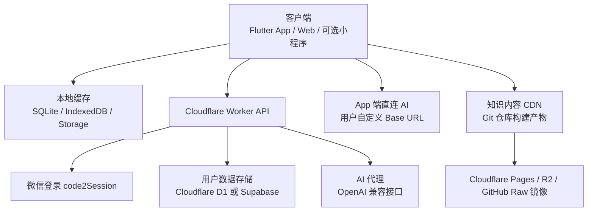
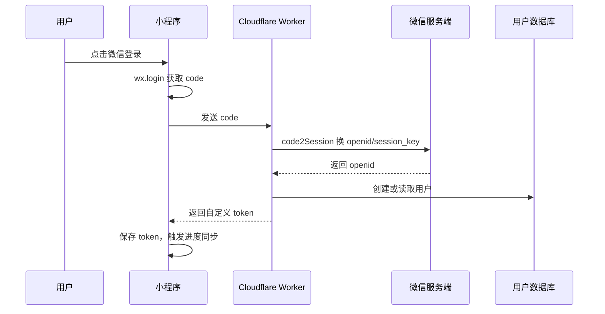
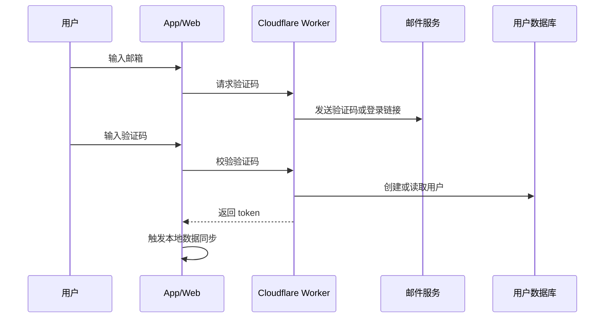
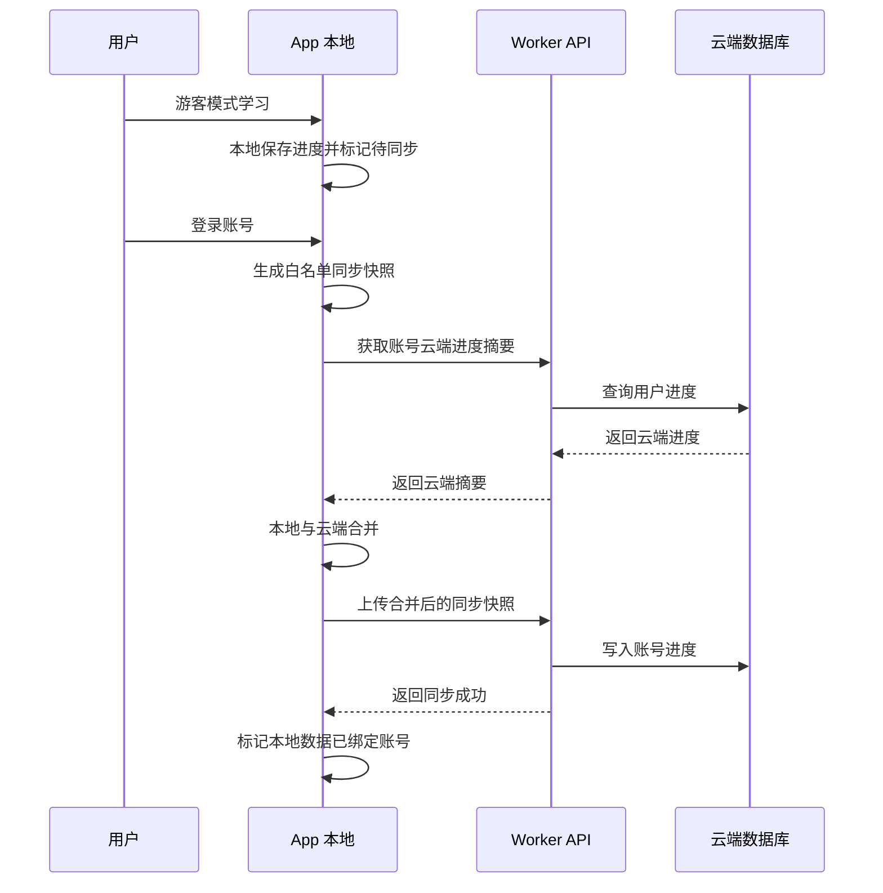
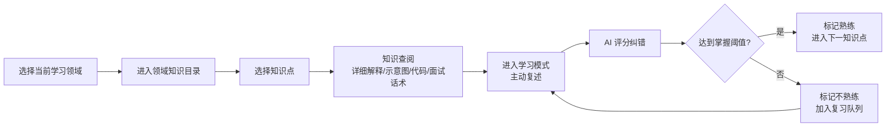
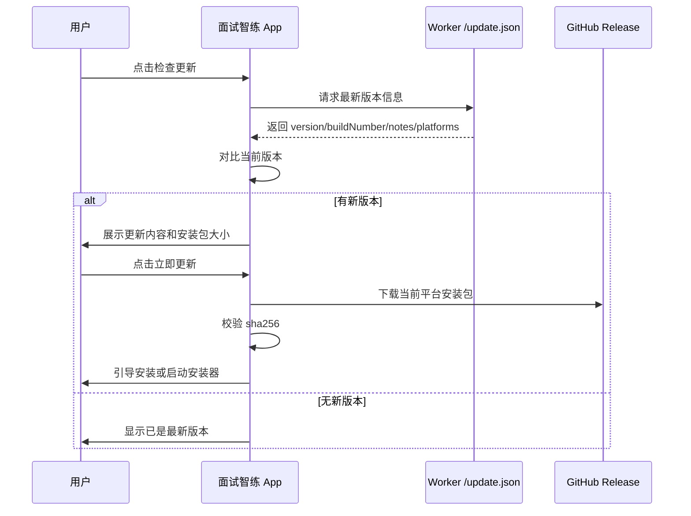
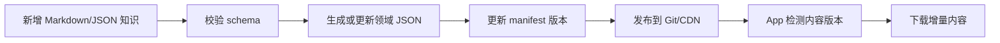

# 面试智练 App 开发设计方案

> 版本：v0.2  
> 日期：2026-05-27  
> 目标：用尽可能低成本的方式，做一个支持 Web、Android、macOS、Windows 的面试学习 App，通过"知识学习 -> 主动复述 -> AI 评估纠错 -> 掌握度更新"帮助用户系统备战技术面试。

## 1. 项目定位

产品中文名：**面试智练**。

含义：面向面试准备的 AI 智能练习工具，强调“先学会，再讲出来，再由 AI 纠正”的主动回忆训练。

正式 Logo：

`assets/logo.svg`

本项目定位为“面试主动回忆训练工具”，不是普通题库，也不是纯笔记阅读器。核心体验类似背单词，但更强调技术知识的解释、理解和面试表达：

1. 用户先选择一个当前学习领域，例如 Java、Agent 开发或算法。
2. App 保留每个领域的独立学习进度，同一时间默认只推进一个领域。
3. 用户进入领域后查看知识目录，再选择具体知识点。
4. 知识点详情先提供较完整的说明、解释、对比、代码、面试话术和必要的动态图/示意图。
5. 用户阅读、理解后进入复述练习。
6. 系统给出概念或面试问题，用户用自己的话回答。
7. AI 根据标准要点进行评分、纠错、补充。
8. 达到掌握阈值后进入下一个知识点，否则进入复习队列。

第一版内容来源使用当前目录下的 `备战计划`，初始领域包括：

| 领域 | 内容来源 | 第一版范围 |
| --- | --- | --- |
| Java | 从 `备战计划` 中抽取 Java 与后端相关内容 | JVM、并发、集合、Spring、数据库、中间件 |
| Agent 开发 | 从 `备战计划` 中抽取 AI 工程化与 Agent 相关内容 | LLM、RAG、Agent、MCP、Function Calling、AI 工程化 |
| 算法 | 从 `备战计划` 中抽取算法与数据结构相关内容 | 数组、链表、树、动态规划、字符串、排序、回溯、图 |

后续可扩展系统设计、项目深挖、模拟面试、简历话术等模块。

注意：`备战计划` 只是第一批内容的原始素材来源，里面的“第几阶段”“第几天”不属于 App 的知识概念。导入内容仓库时需要重新整理为“领域 -> 分类 -> 知识点”的结构，清洗掉天数和阶段编号。

## 2. 参考视觉风格

界面参考目录：

`（参考设计稿，已内化到 App 主题中）`

沿用其中的整体风格：

| 项 | 设计方向 |
| --- | --- |
| 产品气质 | 面向技术面试复习的学习工作台：信息清晰、节奏高效、适合刷知识点和做 AI 复述训练 |
| 主色 | 深科技蓝 `#0A2540`、近黑主色 `#000F22` |
| 强调色 | 青色 `#00CCF9`，用于 AI 练习、当前状态、焦点 |
| 成功色 | 绿色 `#10B981`，表示熟练/掌握 |
| 警示色 | 琥珀色 `#F59E0B`，表示不熟练/待复习 |
| 背景 | 冷灰白 `#F7F9FB`，卡片白色或浅灰 |
| 字体 | Inter 为主，代码和标签用 JetBrains Mono |
| 布局 | PC 端左侧导航 + 内容看板；手机端顶部导航 + 底部 Tab |

这里原先写的“偏 Java 架构师 + AI 工程化”，意思不是要做成只给架构师用的产品，而是视觉和交互要更像专业技术工具：内容密度高、结构清楚、状态反馈明确、代码和概念展示舒服，同时保留 AI 练习的科技感。更直白地说，就是“不花哨，像一个认真备战面试的控制台”。

页面风格应该偏“学习工作台”，避免营销页感。卡片用于知识点、掌握状态、AI 反馈；大面积页面区块保持干净、可扫描。

### 2.1 主题设置

需要加入用户自定义主题能力，避免所有用户只能使用默认深科技蓝。

主题设置入口：个人中心 -> 外观与主题。

第一版主题能力：

| 配置项 | 说明 |
| --- | --- |
| 主题模式 | 跟随系统、浅色、深色 |
| 主色 | 用户可选择或自定义主色，默认 `#0A2540` |
| 强调色 | 用于 AI 练习、选中态、焦点，默认 `#00CCF9` |
| 状态色 | 熟练、不熟练、未掌握保留默认，也允许高级用户调整 |
| 字体大小 | 标准、偏大，方便长时间学习 |
| 卡片密度 | 舒适、紧凑，手机端默认舒适，桌面端默认紧凑 |

内置主题建议：

| 主题 | 主色 | 强调色 | 适合场景 |
| --- | --- | --- | --- |
| 默认科技蓝 | `#0A2540` | `#00CCF9` | 默认学习工作台 |
| Java 深绿 | `#12372A` | `#10B981` | Java/后端复习 |
| 极简灰白 | `#111827` | `#2563EB` | 白天长时间阅读 |
| 夜间护眼 | `#0F172A` | `#22D3EE` | 晚上学习 |

主题数据结构：

```json
{
  "mode": "system",
  "primaryColor": "#0A2540",
  "accentColor": "#00CCF9",
  "successColor": "#10B981",
  "warningColor": "#F59E0B",
  "dangerColor": "#EF4444",
  "fontScale": "normal",
  "density": "comfortable"
}
```

实现建议：

1. Web/H5 使用 CSS Variables，例如 `--color-primary`、`--color-accent`。
2. App 端使用同一份主题 JSON 映射到组件主题。
3. 主题配置默认保存在本地，登录后可同步到云端。
4. 知识点掌握状态颜色不要完全依赖颜色区分，需要同时显示文字状态，照顾色弱用户。

## 3. 端侧形态与技术选型

如果目标仍然是“微信小程序 + H5”，第一版可以使用 `uni-app + Vue 3 + TypeScript`。  
但如果考虑微信小程序限制较大，并且希望同时支持网页、安卓、macOS、Windows，推荐把主路线调整为“原生跨平台 App + Web”。

### 3.1 小程序优先方案

原因：

| 目标 | 说明 |
| --- | --- |
| 微信小程序 | 可编译到微信小程序，支持微信登录和小程序生态 |
| 电脑端 | 同一套代码可编译 H5，用 Cloudflare Pages 部署，电脑浏览器访问 |
| 手机端自适应 | 小程序和 H5 都走响应式布局 |
| 成本 | 前端静态部署免费，后端可用 Cloudflare 免费额度 |
| 后续扩展 | 后续如果要 App，也比纯原生小程序更容易迁移 |

适合场景：需要依赖微信生态、通过微信搜索/分享获客、接受自定义 AI URL 受限。

### 3.2 App 优先方案

推荐技术栈：`Flutter + Dart`。

目标端：

| 平台 | 支持方式 | 说明 |
| --- | --- | --- |
| 网页 | Flutter Web | 可部署到 Cloudflare Pages |
| 安卓 | Flutter Android | 可安装 APK，网络请求限制少 |
| macOS | Flutter macOS | 原生桌面应用 |
| Windows | Flutter Windows | 原生桌面应用 |
| iOS | Flutter iOS | 后续可扩展，但需要 Apple 开发者账号 |

选择 Flutter 的原因：

| 目标 | 说明 |
| --- | --- |
| 多端一致性 | 一套 UI 支持 Web、Android、macOS、Windows |
| 原生能力 | 桌面和安卓端可以更自由地访问用户配置的 AI URL |
| 成本 | 前端仍可静态部署，App 后端可以继续使用 Cloudflare 免费额度 |
| UI 可控 | 适合做学习卡片、看板、响应式布局和主题系统 |
| 后续离线能力 | 本地数据库、文件缓存、知识包下载更自然 |

App 优先方案下，自定义 AI URL 的限制明显少：

| 端 | 自定义 AI URL |
| --- | --- |
| Android App | 可以直接请求，注意用户网络权限和 HTTPS 证书 |
| macOS App | 可以直接请求，注意网络权限和签名设置 |
| Windows App | 可以直接请求 |
| Web | 仍然受 CORS 限制，建议走 Worker 代理 |
| 微信小程序 | 仍然受合法域名限制，建议走 Worker 代理 |

### 3.3 多端方案对比

| 方案 | 优点 | 缺点 | 结论 |
| --- | --- | --- | --- |
| 微信原生小程序 | 微信能力最稳 | 电脑端 H5 需要另做一套 | 不推荐第一版 |
| Taro + React | 多端能力强 | 项目心智成本略高 | 可选 |
| uni-app + Vue 3 | 小程序/H5 成本低，生态成熟 | 原生桌面端不是强项，自定义 URL 仍受小程序限制 | 适合小程序优先 |
| Flutter | Web、Android、macOS、Windows 一套代码，App 限制少 | 微信小程序支持不是主路线，Web 体积较大 | 推荐 App 优先 |
| React Native + Electron + Web | 生态丰富 | 多套壳和适配成本高 | 不推荐第一版 |
| Tauri + Web 前端 | 桌面端轻，性能好 | Android 和 iOS 生态仍在发展，移动端成本不低 | 适合桌面优先 |
| Next.js H5 + 小程序另做 | Web 体验强 | 双端成本高 | 后期再考虑 |

### 3.4 推荐调整

如果现在已经明确想支持“网页、安卓、macOS、Windows”，建议以 **面试智练 App** 作为主项目，架构上采用：

1. 主客户端：`Flutter`，覆盖 Android、macOS、Windows、Web。
2. 可选小程序：后续用 `uni-app` 或微信原生做轻量版，只保留学习、练习、掌握度，不承载复杂 AI 配置。
3. 后端：继续用 Cloudflare Worker + D1/KV/R2。
4. 知识内容：继续 Git + Cloudflare Pages/R2 静态分发。
5. AI 请求：App 端优先直连用户自定义 URL；Web 和小程序端走 Worker 代理。

## 4. 总体架构



核心原则：

1. 知识内容走静态 CDN，不进数据库。
2. 用户数据尽量本地优先，云端只做进度备份和跨端同步；默认优先使用用户自备同步目标，避免平台侧承担高频同步成本。
3. AI 配置优先存在本地，避免云端保存用户 Key 带来的安全和合规压力。
4. Android、macOS、Windows App 优先直连 AI；Web 和小程序根据 CORS/域名限制走代理。
5. 数据同步做批量、延迟写入，减少数据库和第三方 API 访问次数；MVP 同步当前事实快照，不做完整事件溯源。

## 5. 低成本部署方案

### 推荐方案：Cloudflare 优先

| 模块 | 服务 | 成本 |
| --- | --- | --- |
| Web 页面 | Cloudflare Pages | 免费额度足够 |
| App 安装包发布页 | Cloudflare Pages / GitHub Releases | 免费 |
| 知识内容 | Git 仓库 + Cloudflare Pages 静态 JSON | 免费 |
| API | Cloudflare Workers | 免费额度可支撑早期 |
| 用户数据 | Cloudflare D1 | 免费额度可支撑早期 |
| 缓存/配置 | Cloudflare KV | 免费额度可支撑早期 |
| 文件资源 | Cloudflare R2 | 少量数据成本很低 |
| AI 调用 | 用户自带 Key 或免费/低价模型 | 平台侧尽量 0 成本 |

### 更省成本的替代方案

| 方案 | 成本 | 适合阶段 | 风险 |
| --- | --- | --- | --- |
| 纯本地模式 | 几乎 0 成本 | MVP、个人使用 | 换设备后数据不同步 |
| GitHub Pages + LocalStorage | 0 成本 | H5 原型 | 微信登录和小程序能力弱 |
| 微信云开发免费额度 | 低 | 只做微信小程序 | H5/电脑端不如 Cloudflare 灵活 |
| Supabase 免费额度 | 低 | 需要管理后台和 SQL 能力 | 免费额度和网络稳定性需观察 |
| Cloudflare D1 + Worker | 低 | Web + App + 可选小程序 | 小程序需配置合法域名，Web 仍有 CORS 问题 |

第一版建议支持多种运行模式：

1. 游客本地模式：无需登录，知识、进度、AI 配置都存本地。
2. 文件导入导出模式：用户手动生成/恢复备份文件，不自动同步。
3. 用户自备云同步：WebDAV、GitHub、Gitee 等，用户配置自己的账号、仓库或网盘，App 自动同步到当前选择的目标。
4. 平台账号云同步：暂不开放，避免早期消耗平台 Worker/D1 免费额度；后续如需要再作为付费/赞助或自托管能力启用。

这样即使云端服务暂时不用，也可以先把核心学习体验跑通。

## 6. 登录与账号设计

如果主路线改为 App + Web，登录不要只绑定微信。推荐第一版支持游客模式，第二阶段再接入账号同步。

账号方案优先级：

| 方案 | 适合端 | 优点 | 缺点 | 建议 |
| --- | --- | --- | --- | --- |
| 游客本地模式 | 全端 | 0 成本、最快上线 | 不能跨设备同步 | MVP 默认 |
| 邮箱验证码登录 | Web、Android、桌面 | 跨端通用，不依赖微信 | 需要邮件服务 | 推荐同步账号 |
| GitHub OAuth | Web、桌面 | 技术用户接受度高 | 国内用户不一定方便 | 可选 |
| 微信登录 | 微信小程序、移动端 | 微信生态方便 | 桌面/Web 统一性一般 | 小程序版使用 |
| 手机号登录 | 全端 | 用户熟悉 | 短信成本和合规成本 | 暂缓 |

### 6.1 微信登录设计

登录流程：



微信登录注意：

1. `appSecret` 不能放在小程序端，必须放在 Worker 或云函数中。
2. H5 端没有微信小程序 `wx.login`，可先支持游客模式，后续再接微信网页授权或手机号/邮箱登录。
3. 用户头像昵称不应强依赖微信接口，第一版可让用户手动设置昵称，头像用默认图。

### 6.2 App/Web 登录建议

App 和 Web 推荐使用邮箱验证码或一次性登录链接：



为了继续控制成本，MVP 可以先不接邮件服务，只做游客模式和本地数据导出。真正需要跨设备同步时再接入登录。

### 6.3 游客进度迁移

用户可以先不登录直接学习。未登录期间的学习进度、掌握度、复习队列、练习记录摘要和设置都保存在本地。账号云同步暂不开放；后续如启用，App 必须提示并执行“将本机学习进度同步到账号”。

迁移原则：

1. 游客进度不能因为登录而丢失。
2. 登录后默认合并本地进度到账号，而不是用云端空数据覆盖本地。
3. 如果账号云端已有进度，需要执行合并策略。
4. 合并前保留本地快照，避免同步失败导致数据丢失。
5. API Key 默认仍只保存在本地，不随账号同步。

账号云同步合并流程（后置，暂不开放）：



冲突合并规则：

| 数据 | 合并规则 |
| --- | --- |
| 知识点掌握状态 | 优先保留熟练度更高的一方；如果同等级，保留 `updatedAt` 更新的一方 |
| AI 评分 | 保留最高分，同时记录最近一次评分 |
| 复习时间 | 取更早的 `nextReviewAt`，避免漏复习 |
| 当前学习领域 | 优先保留本机当前领域，云端作为可切换历史 |
| 练习记录 | 按记录 `id` 去重后合并，默认只同步摘要，完整回答由用户开关决定 |
| 主题/语言设置 | 登录设备本地设置优先 |
| AI 配置/API Key | 默认只同步配置元数据，不同步 API Key；如需同步密钥，必须端到端加密 |

## 7. 功能模块设计

### 7.1 学习模块

核心页面：

| 页面 | 功能 |
| --- | --- |
| 学习首页 | 展示当前学习领域、领域掌握度、领域入口和继续学习入口 |
| 领域知识目录 | 点击 Java、Agent 开发、算法领域卡片后进入，查看该领域下的所有知识内容 |
| 知识目录 | 按领域、知识分类、知识点展示，可筛选熟练/不熟练/未掌握 |
| 知识点学习页 | 先提供详细说明解释、核心要点、代码片段、面试话术、复杂知识动态图/示意图 |
| 主动复述页 | 隐藏答案，给出概念或问题，让用户复述 |
| AI 评估结果页 | 展示评分、遗漏点、错误点、优化回答、下一步建议 |

学习首页调整为“当前领域工作台”，不再承载 AI 配置、语言、主题等设置项。设置类入口统一放到个人中心。

领域卡片交互：

1. Java、Agent 开发、算法卡片都可以点击。
2. 点击后进入领域知识目录。
3. 在领域知识目录中可以查看领域进度、所有知识点、知识点状态。
4. 每个知识点提供两个入口：知识查阅、学习模式。
5. 切换当前学习领域时，保留其他领域的学习进度、复习队列和掌握度。

学习流程：



复杂知识展示要求：

| 内容类型 | 展示方式 |
| --- | --- |
| 抽象概念 | 分层解释、类比说明、面试回答模板 |
| JVM/并发/Agent 流程 | 动图、流程图、状态流转图 |
| 算法 | 步骤动画、数组/链表/树/图状态变化 |
| 代码原理 | 代码块 + 行级解释 + 常见追问 |
| 面试表达 | 标准回答、精简版回答、进阶版回答 |

AI 评分维度建议：

| 维度 | 权重 | 说明 |
| --- | --- | --- |
| 核心概念完整性 | 40% | 是否覆盖标准要点 |
| 表达准确性 | 25% | 是否有明显错误或混淆 |
| 面试表达质量 | 20% | 是否像面试回答，结构是否清晰 |
| 扩展深度 | 15% | 是否能结合场景、优缺点、实践经验 |

掌握状态规则：

| 状态 | 条件 |
| --- | --- |
| 未掌握 | 未学习，或最近评分低于 60 |
| 不熟练 | 评分 60-84，或多次遗漏关键点 |
| 熟练 | 最近 2 次评分均大于等于 85，且间隔复习通过 |

### 7.2 练习模块

练习模块和学习模块的区别：学习模块按知识点顺序推进，练习模块用于打乱、复习、模拟面试。

第一版练习类型：

| 类型 | 说明 |
| --- | --- |
| 今日复习 | 根据遗忘曲线和不熟练知识点生成 |
| 随机抽问 | 从某个领域随机抽取概念 |
| 高频面试题 | 从知识源里的 Q&A、复习题中生成 |
| 模拟面试 | 连续多题，最后给出整体反馈 |
| 错题重练 | 针对历史低分回答 |

输入方式：

1. 文本输入：第一版必须支持。
2. 语音输入：支持系统语音识别和 Whisper 兼容 STT；用户触发语音功能时请求麦克风/语音识别权限，拒绝或永久拒绝后提示前往系统设置授权。
3. 代码/伪代码输入：算法和 Agent 题支持切换到代码模式。

### 7.3 AI 配置模块

位置：个人中心 -> AI 配置。

需求：

1. 支持多个 AI 配置。
2. 每个配置包含名称、Base URL、API Key、模型名、接口类型。
3. 学习或练习时可以切换当前配置。
4. 支持测试连接。
5. 支持默认配置、禁用配置、删除配置。

数据结构：

```json
{
  "id": "cfg_openai_compatible_001",
  "name": "DeepSeek",
  "providerType": "openai-compatible",
  "baseUrl": "https://api.example.com/v1",
  "apiKey": "local-encrypted-key",
  "model": "deepseek-chat",
  "enabled": true,
  "isDefault": true
}
```

跨端请求说明：

1. Android、macOS、Windows App 可以优先直接请求用户自定义 Base URL。
2. Web 端会遇到 CORS 限制，如果目标模型服务没有放开跨域，就走固定 Cloudflare Worker 代理。
3. 微信小程序网络请求域名需要提前配置合法域名，用户自定义任意 URL 不能直接从小程序端请求，因此小程序必须走固定 Worker 代理。
4. Worker 不长期保存用户 Key，只在本次请求中转发；Key 默认保存在用户本地。

安全建议：

1. MVP 阶段 API Key 只保存在本地，不上传云端。
2. 如果后续需要多设备同步 Key，必须做端到端加密：用户设置一个同步密码，客户端加密后再上传，服务端不保存明文。
3. AI 代理接口需要做频率限制，避免被滥用。

### 7.4 个人中心

个人中心是账号、设置、配置和数据管理的统一入口。首页不直接展开所有表单，而是展示账号摘要和分组入口；复杂配置进入子页面，避免设置项增加后形成巨长页面。

首页结构：

| 区块 | 内容 |
| --- | --- |
| 账号摘要 | 头像、昵称、登录状态、练习数、连续天数、当前同步方式 |
| 同步与备份 | 当前同步方式、最近同步状态、进入同步配置页 |
| AI 与语音 | 默认 AI 模型状态、语音识别模式、进入 AI/语音配置页 |
| 学习偏好 | 每日新题/复习数、推荐策略、进入学习策略页 |
| 外观与语言 | 当前主题、字号密度、语言、进入外观语言页 |
| 内容源 | 当前内容环境、内容 URL、进入内容源页 |
| 关于与更新 | 版本、检查更新入口 |

子页面功能：

| 功能 | 说明 |
| --- | --- |
| 账号登录/退出 | MVP 可先游客模式，后续支持邮箱/账号登录；微信登录仅小程序轻量版需要 |
| 同步与备份 | 同步方式、目标账号配置、自动同步、同步内容开关、手动同步、恢复、文件导入导出 |
| AI 与语音 | AI 配置入口、默认模型状态、系统语音/Whisper 配置 |
| 学习偏好 | 当前学习领域、每日新知识数、每日复习数、推荐策略 |
| 外观与语言 | 主题模式、主色、强调色、字体大小、卡片密度、中英文切换 |
| 内容源 | 发布版/测试版/草稿版、自定义 URL、清缓存重载 |
| 学习统计 | 总知识点、已学、熟练、不熟练、未掌握 |
| 检查更新 | 检查 GitHub/更新源上的最新版本，有新版本时展示更新内容并引导安装 |

学习推荐策略配置：

| 策略 | 说明 |
| --- | --- |
| 优先补低分知识 | 默认策略，优先推荐不熟练和未掌握知识 |
| 按知识路径顺序 | 按内容仓库中整理后的领域、分类、知识点路径推进，不保留“第几天”概念 |
| 高频知识优先 | 优先推荐 JVM、并发、Spring、RAG、Agent、DP 等高频点 |

### 7.5 软件更新模块

位置：个人中心 -> 关于面试智练 -> 检查更新。

目标：

1. 用户可以手动点击“检查更新”。
2. App 通过 `RouteResolver.appApi + /update.json` 自动请求远程更新清单。
3. 如果有新版本，展示版本号、发布时间、更新内容、安装包大小。
4. 用户确认后下载当前平台对应安装包。
5. 下载完成后校验 `sha256`。
6. 校验通过后引导用户安装或启动系统安装器；Android 如未授权安装第三方 APK，提示用户前往系统设置开启“允许安装未知应用”。

更新源建议：

| 方案 | 说明 |
| --- | --- |
| GitHub Releases | 安装包和历史版本放在 `nontracey/mianshi-zhilian-app/releases` |
| Cloudflare Worker | 提供稳定的 `/update.json`，代理 GitHub latest release 中的更新清单 |
| App Web 主备镜像 | 通过 `assetPath` 生成 pages.dev / de5.net 官方下载候选 |

第一版推荐：安装包放 GitHub Releases，`update.json` 随 Release 上传，Worker 的 `/update.json` 代理 latest release 资产。生产构建不再注入 `UPDATE_MANIFEST_URL` 固定域名，官方主备地址由客户端 route resolver 统一维护。

`update.json` 示例：

```json
{
  "version": "0.1.0",
  "buildNumber": 100,
  "releaseDate": "2026-05-27",
  "minimumRequiredVersion": "0.1.0",
  "notes": [
    "新增领域知识目录",
    "新增 AI 复述评估",
    "优化掌握度排序"
  ],
  "platforms": {
    "android": {
      "url": "https://github.com/nontracey/mianshi-zhilian-app/releases/download/v0.1.0/mianshi-zhilian-v0.1.0-android.apk",
      "assetPath": "/releases/latest/download/mianshi-zhilian-v0.1.0-android.apk",
      "sha256": "待生成",
      "size": 52428800
    },
    "windows": {
      "url": "https://github.com/nontracey/mianshi-zhilian-app/releases/download/v0.1.0/mianshi-zhilian-v0.1.0-windows-setup.exe",
      "sha256": "待生成",
      "size": 73400320
    },
    "macos": {
      "url": "https://github.com/nontracey/mianshi-zhilian-app/releases/download/v0.1.0/mianshi-zhilian-v0.1.0-macos.dmg",
      "sha256": "待生成",
      "size": 83886080
    }
  }
}
```

检查更新流程：



各平台更新策略：

| 平台 | MVP 策略 | 正式策略 |
| --- | --- | --- |
| Android | 下载 APK，用户确认安装 | 后续可接应用商店或内置 APK 更新 |
| Windows | 下载 `.exe`/`.zip` 并启动安装器 | MSIX App Installer 或专业更新器 |
| macOS | 下载 `.dmg`/`.zip` 并引导安装 | Sparkle 自动更新，需要签名和 notarization |
| Web | Cloudflare Pages 自动更新 | 刷新即更新，配合缓存策略 |

系统权限策略：

1. 权限只在用户触发对应功能时请求，不在启动时打扰用户。
2. 语音输入请求麦克风/语音识别权限；图片上传和头像拍摄请求相机/相册权限；Android 安装 APK 请求安装应用权限。
3. 如果用户拒绝权限，功能保持可取消状态；如果系统报告永久拒绝或受限，弹窗说明用途并提供“去系统设置”入口。
4. Web 端不走原生权限服务；macOS 使用系统原生权限弹窗和 `Info.plist`/entitlements 声明。

版本规则：

1. 使用 SemVer：`major.minor.patch`。
2. `buildNumber` 用于同版本内部构建递增。
3. `minimumRequiredVersion` 大于当前版本时提示强制更新。
4. 非强制更新由用户决定是否安装。
5. Web 端不需要下载安装包，只需要提示刷新页面或自动刷新。

### 7.6 掌握度看板

掌握度看板参考 `stitch_ai/_1/screen.png`，并按当前原型调整为“领域优先”：

1. 默认显示当前学习领域。
2. 支持切换 Java、Agent 开发、算法领域。
3. 每个领域显示领域总掌握百分比。
4. 领域内展示所有知识点。
5. 每个知识点显示状态、标题、简介、标签、评分或熟练度。
6. 支持按熟练度从低到高、从高到低排序。
7. 可选支持按状态筛选：熟练、不熟练、未掌握。

排序规则：

| 排序 | 说明 |
| --- | --- |
| 熟练度低到高 | 用于优先补短板，是默认推荐 |
| 熟练度高到低 | 用于快速查看优势知识 |
| 最近练习时间 | 后续可加，用于复习管理 |

### 7.7 中英文切换

实现方案采用自定义 L10n 静态类 + Provider 封装，未使用 `intl` 或 `easy_localization`，以保持零代码生成依赖和轻量级维护。

### L10n 静态类 (`lib/l10n/l10n.dart`)

- 默认语言为中文 (`zh`)。
- `_zh` / `_en` 使用同一组英文 `snake_case` key，当前由检查脚本保证 key 不重复、语言 map 同步，并拦截常见 UI 硬编码中文。
- key 是稳定英文标识符，不能使用中文、拼音、Unicode/hex 中文、参数占位符或任意显示文本。
- `get(key, language)`: 按语言查找，未命中时依次 fallback 到中文、英文、key 本身。
- `getp(key, language, params)`: 模板插值，支持 `{param}` 替换。
- 新增语言时只需要新增完整语言 map 并注册到 `_localizedValues`，UI 调用处不需要调整。

### LocalizationProvider (`lib/providers/localization_provider.dart`)

包装 L10n 的 ChangeNotifier，通过 Provider 向组件树提供响应式语言切换：

- `setLanguage(lang)` → 切换语言，通知所有消费者重建。
- `get(key)` / `getp(key, params)` → 调用 L10n 同名静态方法。

### 维护脚本

国际化只保留一个规则门禁脚本：

```bash
cd apps/client
python3 lib/l10n/check_l10n_keys.py
```

该脚本检测：

1. key 必须是英文 `snake_case`，且以英文字母开头。
2. key 不能包含中文、Unicode/hex 中文、参数占位符或标点。
3. 各语言 map 不能有重复 key，且 key 集合必须完全一致。
4. 调用处 `l10n.get()` / `l10n.getp()` 必须引用已定义 key。
5. `getp()` 的 `{param}` 占位符在各语言 value 中必须一致。
6. 常见 UI 展示入口不能硬编码中文，例如 `Text('中文')`、`SnackBar(content: Text('中文'))`、`labelText`、`hintText`、`tooltip`。
7. `titleKey`、`descKey`、`nameKey`、`labelKey`、`phaseKey` 等配置字段必须保存英文 key，不能保存中文展示文本。
8. label/title/name/description/frequency 类 getter 不能直接返回中文展示文本；应返回英文 key，由 UI 层调用 l10n 翻译。

历史 l10n 迁移、诊断、修复脚本已清理，避免后续误用。

需要国际化的内容：

1. UI 文案：按钮、导航、提示、状态。
2. 知识点标题和摘要：可先只做中文，英文为后续扩展。
3. AI 评估 Prompt：需要中英文两套提示词。

允许保留为数据或常量的内容：用户输入、知识库正文、题目内容、URL、模型名、品牌名、`API Key` 等技术常量，以及不会直接展示给用户的 AI 内部上下文标记。只要它变成 UI chrome，就必须进入 l10n。

内容策略：

| 阶段 | 策略 |
| --- | --- |
| MVP | UI 支持中英文，知识内容以中文为主 |
| v1 | 关键知识点补充英文标题、英文摘要 |
| v2 | 支持英文面试回答训练 |

## 8. 知识内容仓库设计

知识内容必须独立于 App 代码。App 只内置通用渲染能力和内容 schema，领域、分类、知识点、学习卡片、复述题、评分 rubric、动画/图片资源都通过内容仓库下发。

核心原则：

1. 新增领域不改 App 代码。
2. 新增分类不改 App 代码。
3. 新增知识点不改 App 代码。
4. 调整知识顺序、推荐权重、标签、难度不改 App 代码。
5. App 通过 `manifest.json` 发现内容包，通过 schema 版本判断是否兼容。

知识维护不放在普通 App 内。后续需要单独建设“面试智练内容工作台”，用于 AI 生成知识、人工编辑、schema 校验、App 效果预览和提交内容 PR。详细方案见：

`docs/design.md（知识维护方案）`

内容发布必须区分测试环境和正式环境。AI 生成或 PR 合并后的知识不能直接进入正式用户内容，必须先进入 staging 内容环境，经过人工预览、测试和确认发布后，才更新正式 `manifest.json`。

当前 Markdown 知识源适合转换成结构化 JSON，再由前端按需加载。

内容仓库不应沿用原始目录中的“第几阶段/第几天”结构。转换脚本需要把原始面试计划清洗成产品自己的知识模型：

```text
原始素材路径：备战计划/第1阶段-Java核心基础/第01天-JVM内存模型/01-运行时数据区概述.md
转换后知识路径：java / jvm / runtime-data-area
```

清洗规则：

1. 删除 `第X阶段`、`第XX天`、`Day X` 等排期概念。
2. 保留真正的知识分类，例如 JVM、并发、Spring、RAG、Agent、动态规划。
3. `sourceRef` 只作为内部溯源备注，不作为用户可见字段，也不作为学习路径字段。
4. 用户侧只看到领域、分类、知识点、掌握度和练习状态。

建议目录：

```text
content-repo/
  manifest.json
  schemas/
    topic.schema.json
    domain.schema.json
  assets/
    java/
      jvm-memory-flow.webp
  domains/
    java.json
    agent.json
    algorithm.json
  topics/
    java/
      jvm-runtime-data-area.json
      gc-algorithm.json
    agent/
      react-agent.json
    algorithm/
      array-basic.json
```

manifest 示例：

```json
{
  "schemaVersion": "1.0.0",
  "contentVersion": "2026.05.27",
  "minAppVersion": "0.1.0",
  "defaultDomain": "java",
  "domains": [
    {
      "id": "java",
      "title": "Java 核心与中间件",
      "description": "JVM、并发、集合、Spring、数据库、中间件",
      "entry": "domains/java.json",
      "topicCount": 42,
      "updatedAt": "2026-05-27"
    },
    {
      "id": "agent",
      "title": "Agent 开发",
      "description": "LLM、RAG、Agent、MCP、Function Calling",
      "entry": "domains/agent.json",
      "topicCount": 38,
      "updatedAt": "2026-05-27"
    }
  ]
}
```

领域 JSON 示例：

```json
{
  "id": "java",
  "title": "Java 核心与中间件",
  "description": "面向后端技术面试的 Java 知识体系。",
  "icon": "code",
  "themeColor": "#0A2540",
  "accentColor": "#00CCF9",
  "categories": [
    {
      "id": "jvm",
      "title": "JVM",
      "description": "运行时内存、GC、类加载、调优",
      "order": 10,
      "topics": [
        "topics/java/topic-001-ebcc71cb.json",
        "topics/java/topic-002-3bee1565.json"
      ],
      "prerequisites": ["java-fundamentals"]
    },
    {
      "id": "concurrency",
      "title": "并发编程",
      "description": "线程、锁、线程池、并发容器",
      "order": 30,
      "topics": [],
      "prerequisites": ["jvm"]
    }
  ],
  "learningPaths": [
    {
      "id": "java-backend",
      "title": "Java 后端面试路线",
      "description": "从 JVM 基础到中间件，按依赖关系逐步深入",
      "steps": [
        {
          "title": "JVM 基础",
          "description": "理解内存区域、GC 机制、类加载",
          "categoryIds": ["jvm"],
          "estimatedHours": 4
        },
        {
          "title": "并发编程",
          "description": "线程、锁、线程池、并发容器",
          "categoryIds": ["concurrency"],
          "estimatedHours": 5,
          "prerequisiteSteps": ["JVM 基础"]
        }
      ]
    }
  ]
}
```

知识点 JSON：

```json
{
  "id": "java.jvm.runtime-data-area",
  "domain": "java",
  "category": "jvm",
  "group": "memory-management",
  "title": "JVM 运行时数据区",
  "summary": "理解程序计数器、虚拟机栈、本地方法栈、堆、方法区的职责和生命周期。",
  "tags": ["JVM", "Heap", "Stack", "Metaspace"],
  "difficulty": 2,
  "estimatedMinutes": 20,
  "order": 10,
  "recommendWeight": 90,
  "status": "production",
  "prerequisites": [],
  "interviewFrequency": "high",
  "interviewerFocus": "考察对 JVM 内存管理的理解深度，能否区分线程私有和共享区域",
  "learningCards": [
    {
      "type": "explain",
      "title": "核心概念",
      "content": "JVM 在执行 Java 程序时，会把内存划分为不同运行时数据区。程序计数器、虚拟机栈、本地方法栈属于线程私有；堆和方法区属于线程共享。"
    },
    {
      "type": "interviewAnswer",
      "title": "面试回答模板",
      "content": "面试时我会先按线程私有和线程共享来讲……",
      "followUpQuestions": [
        {
          "question": "能结合实际项目说说 JVM 调优经验吗？",
          "answer": "GC 调优的核心是理解对象的生命周期。新生代用复制算法，老年代用标记-清除……"
        }
      ]
    },
    {
      "type": "animation",
      "title": "一次方法调用中的 JVM 内存流转",
      "asset": "assets/java/jvm-memory-flow.webp",
      "fallback": "如果动画加载失败，用流程图展示栈帧创建、对象进入堆、类信息在元空间共享。",
      "caption": "左侧线程创建栈帧，右侧堆保存对象实例，元空间保存类信息。"
    },
    {
      "type": "checklist",
      "title": "学完后应能说清楚",
      "items": [
        "程序计数器为什么线程私有",
        "堆和栈的区别",
        "方法区和元空间的关系"
      ]
    },
    {
      "type": "compareTable",
      "title": "堆和栈的区别",
      "columns": ["维度", "堆", "栈"],
      "rows": [
        ["线程关系", "线程共享", "线程私有"],
        ["存储内容", "对象实例", "栈帧、局部变量"]
      ]
    },
    {
      "type": "code",
      "title": "线程池创建示例",
      "language": "java",
      "content": "ThreadPoolExecutor executor = new ThreadPoolExecutor(...);",
      "highlights": [
        { "line": 1, "note": "不要直接使用 Executors 创建无限队列线程池。" }
      ]
    },
    {
      "type": "diagram",
      "title": "RAG 全流程",
      "content": "RAG 流程示意",
      "items": ["文档切分", "向量化", "向量库存储", "召回", "重排", "生成"],
      "svgPath": "https://cdn.example.com/rag-pipeline.svg",
      "fallback": "RAG 流程：文档 → 切分 → Embedding → 向量库 → 召回 → 重排 → 生成"
    }
  ],
  "recallPrompts": [
    {
      "id": "java.jvm.runtime-data-area.recall.1",
      "prompt": "请用自己的话解释 JVM 运行时数据区的划分。",
      "mode": "text",
      "expectedMinutes": 3,
      "difficulty": 2
    },
    {
      "id": "java.jvm.runtime-data-area.recall.2",
      "prompt": "如果面试官问堆和栈有什么区别，你会怎么回答？",
      "mode": "text",
      "expectedMinutes": 2,
      "difficulty": 1
    }
  ],
  "rubric": {
    "mustHave": ["线程私有区域", "线程共享区域", "堆", "虚拟机栈", "方法区"],
    "goodToHave": ["程序计数器不会 OOM", "JDK 8 后元空间替代永久代"],
    "commonMistakes": ["把方法区直接等同于永久代", "忽略程序计数器线程私有"],
    "scoreWeights": {
      "coverage": 40,
      "accuracy": 25,
      "interviewExpression": 20,
      "depth": 15
    }
  },
  "sourceRef": "运行时数据区概述.md"
}
```

知识点字段说明：

| 字段 | 必填 | 说明 |
| --- | --- | --- |
| `id` | 是 | 全局唯一，推荐格式：`domain.category.topic`。 |
| `domain` | 是 | 所属领域 ID。 |
| `category` | 是 | 所属分类 ID。 |
| `group` | 否 | 更细分的组，例如 `memory-management`。 |
| `title` | 是 | 知识点标题。 |
| `summary` | 是 | 一句话摘要。 |
| `tags` | 是 | 标签，用于搜索和展示。 |
| `difficulty` | 是 | 难度，建议 1-5。 |
| `estimatedMinutes` | 是 | 建议学习时长。 |
| `order` | 是 | 领域内默认学习顺序。 |
| `recommendWeight` | 是 | 推荐权重，0-100。 |
| `status` | 否 | 生产状态，`production`（正式）或 `draft`（草稿），默认 `draft`。 |
| `prerequisites` | 否 | 前置依赖知识点 ID 数组，例如 `["java.jvm.runtime-data-area"]`。 |
| `interviewFrequency` | 否 | 面试频率，`high`（高频）/ `medium`（中频）/ `low`（低频）。 |
| `interviewerFocus` | 否 | 面试官关注点，说明面试官问这个知识点时真正想考察什么。 |
| `leetcodeUrl` | 否 | 关联 LeetCode 题目链接。 |
| `learningCards` | 是 | 学习内容卡片。 |
| `recallPrompts` | 是 | 主动复述题。 |
| `rubric` | 是 | AI 评估标准。 |
| `sourceRef` | 否 | 内部溯源，不给用户展示。 |

App 渲染约定：

| 内容字段 | App 行为 |
| --- | --- |
| `domains` | 自动生成学习中心领域卡片和领域切换，`themeColor` 用于领域主题色 |
| `categories` | 自动生成领域知识目录分组，`order` 控制排序 |
| `topics` | 自动生成知识点列表 |
| `learningCards` | 按 `type` 渲染：explain（Markdown）、code（语法高亮，优先用 `language` 字段）、compareTable（优先用 `columns`/`rows` 结构化表格）、diagram（优先用 `svgPath`/`asset` 渲染 SVG/图片，兜底用 items 智能图解）、animation（图片/动画）、interviewAnswer（面试回答 + 追问）、checklist（检查清单） |
| `recallPrompts` | 生成主动复述题，支持 text/code/voice 模式 |
| `rubric` | 生成 AI 评估 Prompt，包含 mustHave、goodToHave、commonMistakes、scoreWeights |
| `order` | 控制默认学习路径 |
| `recommendWeight` | 参与推荐策略计算 |
| `status` | 控制是否显示给正式用户（仅显示 `production` 状态） |
| `prerequisites` | 构建学习路径图，显示前置依赖关系 |
| `interviewFrequency` | 参与推荐算法，高频知识点优先推荐 |
| `interviewerFocus` | 展示面试官关注点，帮助理解考察方向 |
| `leetcodeUrl` | 展示关联 LeetCode 题目链接 |

内容扩充流程：



兼容策略：

1. `schemaVersion` 不变时，App 可直接加载新内容。
2. 新增字段必须向后兼容，旧 App 忽略不认识的字段。
3. 如果内容使用了新渲染能力，需要提高 `minAppVersion`。
4. 内容发布失败不能影响本地已缓存知识，App 继续使用上一个可用版本。

构建流程：


## 9. 用户数据设计

### 9.1 本地数据

本地优先保存：

| 数据 | 存储 |
| --- | --- |
| 当前学习进度 | 小程序 Storage / H5 IndexedDB |
| 知识点掌握状态 | 本地 |
| 练习草稿 | 本地 |
| 游客事件队列 | 本地 |
| 待同步队列 | 本地 |
| 登录前进度快照 | 本地 |
| 失败重试记录 | 本地 |
| AI 配置和 Key | 本地加密 |
| 内容 manifest 缓存 | 本地 |
| 最近访问知识点 | 本地 |

### 9.2 同步模式与内容边界

同步不是全局广播，而是当前模式绑定当前目标：

| 同步方式 | 自动同步 | 目标 | 说明 |
| --- | --- | --- | --- |
| 本地模式 | 否 | 本机存储 | 纯本地，不上传任何数据 |
| 文件导入导出 | 否 | 用户手动文件 | 只做备份/恢复，不参与自动同步 |
| WebDAV | 是 | 用户配置的 WebDAV 目录 | 用户承担存储成本，写入白名单同步快照 |
| GitHub | 是 | 用户配置的仓库文件 | 使用用户 token 创建/更新同步 JSON 文件 |
| 平台账号云同步 | 否 | Worker + D1 | 暂不开放，避免消耗平台免费额度 |

默认同步“当前事实状态”，不做完整事件溯源。同步包使用白名单结构：

```json
{
  "schemaVersion": 1,
  "app": "mianshi-zhilian",
  "updatedAt": "2026-06-02T00:00:00.000Z",
  "deviceId": "device_xxx",
  "data": {
    "progress_map": {},
    "practice_attempts": [],
    "sessions": [],
    "mock_interview_sessions": [],
    "prep_plan": {},
    "prep_goal": {},
    "training_plan": {},
    "project_library": [],
    "project_dig_projects": [],
    "answer_versions": {},
    "custom_routes": [],
    "selected_route_id": "",
    "disabled_domains": [],
    "settings": {},
    "local_profile": {}
  }
}
```

默认同步内容：

| 数据 | 策略 |
| --- | --- |
| 知识点进度、分数、复习时间 | 必须同步 |
| 练习记录摘要、练习 session、模拟面试摘要 | 默认同步 |
| 备考计划、训练计划、目标岗位信息 | 默认同步，但在 UI 中提示可能包含隐私 |
| 项目库、项目深挖材料 | 默认同步，但在 UI 中提示可能包含隐私 |
| 回答版本库 | 默认同步 |
| 自定义路线、禁用领域、当前路线 | 默认同步 |
| 主题、语言、学习推荐参数、内容源偏好 | 默认同步 |
| AI 配置元数据 | 可选同步，默认同步名称、Base URL、模型、能力标签，不同步 API Key |

用户可选内容：

| 开关 | 默认 | 说明 |
| --- | --- | --- |
| 同步完整练习回答 | 关 | 关闭时只同步题目、分数、标签、摘要、下一步建议等摘要字段 |
| 同步项目库和备考目标 | 开 | 可能包含公司、岗位、JD、项目经历 |
| 同步 AI 配置元数据 | 开 | 不包含 API Key |

禁止同步内容：

| 数据 | 原因 |
| --- | --- |
| 登录 token、refresh token、平台账号登录态 | 凭证数据，不能进入任何同步目标 |
| WebDAV/GitHub/Gitee token、密码、应用密码 | 同步目标凭证，只保存在本机 |
| AI API Key、Whisper API Key | 默认只保存在本机 |
| 内容缓存、manifest 缓存、domain 缓存、版本缓存 | 可重新下载，不需要同步 |
| `_lastSyncTime`、dirty 标记、失败记录 | 本机运行态，不跨设备同步 |
| 工单、本机错误日志 | 不属于学习数据同步 |

如未来支持密钥跨端同步，必须先实现端到端加密：密钥只在客户端加解密，服务端和第三方同步目标只能看到密文。

### 9.3 云端数据

云端只存必要数据：

| 表 | 说明 |
| --- | --- |
| `users` | openid、昵称、创建时间、最后登录时间 |
| `user_topic_progress` | 每个知识点的状态、分数、复习时间 |
| `practice_sessions` | 练习记录摘要，不存完整长文本或仅在用户开启后存 |
| `sync_snapshots` | 当前同步快照或按 topic 拆分的事实状态 |
| `user_settings` | 语言、当前领域、同步配置，不存明文 API Key |
| `device_links` | 登录后记录本地设备与账号的绑定关系，用于避免重复迁移 |

### 9.4 自动同步触发策略

1. 启动时不立即全量读数据库，先读本地缓存。
2. 登录后先执行游客进度迁移；已经绑定过账号的设备再拉取 `updatedAt` 晚于本地最后同步时间的数据。
3. 用户练习过程只写本地，并标记同步 dirty，不每题都写云端。
4. 满足以下条件之一再批量同步：
   - 本地数据变更后经过防抖时间。
   - 完成一次练习会话。
   - 退出页面。
   - 距离上次成功同步超过配置间隔。
   - 用户手动点击同步。
5. 同一时间只允许一个同步任务运行；遇到远端版本冲突时先拉取、合并，再重新上传。
6. 云端保存事实快照，历史详细回答默认只存最近 N 条或由用户开启完整同步。
7. 知识内容使用 CDN 缓存和版本号，不查数据库。
8. 自动同步拉取远端数据后，需要刷新内存中的 Provider 状态，避免“数据已落盘但当前页面未更新”。
9. 文件导入导出模式使用同一份白名单同步包，不导出登录态、API Key、同步凭证和缓存数据。
10. GitHub/Gitee 更新文件如遇 sha 冲突，至少自动重试一次：重新拉取远端、合并本地快照、再上传。

### 9.5 超额和服务失败保护

免费额度或第三方服务不可用时，产品必须保证“能继续学、不丢进度、提示清楚”。

| 场景 | 用户侧表现 | 产品保护 |
| --- | --- | --- |
| Worker 请求超额或 API 不可用 | 登录、平台云同步、Web AI 代理、检查更新失败 | 本地学习继续可用；推荐用户使用 WebDAV/GitHub/Gitee 自备同步 |
| D1 读写超额或数据库不可用 | 云端进度拉取/上传失败 | 本地进度不受影响；显示云同步暂不可用 |
| 内容 CDN 暂时不可用 | 新内容无法更新 | 使用本地已缓存的 manifest 和知识内容 |
| GitHub/更新源不可用 | 检查更新失败 | 显示检查更新失败，不影响学习 |
| AI 模型额度不足或调用失败 | AI 评估失败 | 保留用户答案草稿，允许切换 AI 配置后重试 |
| Web 端 CORS 或代理失败 | Web AI 评估失败 | 提示使用 App 端直连或切换代理配置 |

保护规则：

1. 学习、知识查阅、掌握度查看必须优先使用本地数据。
2. 云同步失败不能阻断学习流程。
3. 所有本地学习数据先写入本地，再标记待同步。
4. 同步失败时保留本地数据并记录失败原因，下次启动、网络恢复、用户手动同步时重试。
5. AI 评估失败不能清空用户输入。
6. 内容更新失败时继续使用上一个可用内容版本。
7. 检查更新失败只提示，不弹阻断式错误。
8. 错误提示要区分类型：云同步失败、AI 调用失败、内容更新失败、软件更新失败。

用户提示文案建议：

| 类型 | 建议文案 |
| --- | --- |
| 云同步失败 | `云端同步暂时不可用，本地进度已保存，稍后会自动重试。` |
| AI 调用失败 | `当前 AI 配置调用失败，请检查额度、Key 或切换模型配置。` |
| 内容更新失败 | `暂时无法获取最新内容，已继续使用本地缓存版本。` |
| 检查更新失败 | `暂时无法检查新版本，请稍后再试。` |
| 免费额度达到上限 | `服务今日请求量较高，部分云端能力暂时不可用，本地学习不受影响。` |

同步事件示例：

```json
{
  "eventId": "evt_001",
  "userId": "u_001",
  "type": "topic_progress_updated",
  "topicId": "java.jvm.runtime-data-area",
  "payload": {
    "status": "skilled",
    "score": 88,
    "reviewCount": 3,
    "nextReviewAt": "2026-05-29T10:00:00+08:00"
  },
  "clientUpdatedAt": "2026-05-27T22:10:00+08:00"
}
```

## 10. AI 评估设计

AI 请求统一走一个 OpenAI 兼容格式，降低不同模型适配成本。

评估 Prompt 输入：

| 字段 | 说明 |
| --- | --- |
| 知识点标题 | 当前知识点 |
| 标准要点 | `rubric.mustHave` |
| 常见错误 | `rubric.commonMistakes` |
| 用户回答 | 用户输入文本 |
| 目标语言 | 中文或英文 |
| 输出格式 | 固定 JSON |

AI 输出格式：

```json
{
  "score": 86,
  "level": "skilled",
  "summary": "整体理解正确，但可以补充方法区和元空间的区别。",
  "missedPoints": ["方法区是规范，元空间是 HotSpot 实现"],
  "wrongPoints": [],
  "improvedAnswer": "面试时可以这样回答：...",
  "nextAction": "进入下一知识点"
}
```

成本控制：

1. 学习卡片不调用 AI，只读取静态内容。
2. 只有用户提交复述时调用 AI。
3. Prompt 尽量短，只传当前知识点 rubric，不传整篇 Markdown。
4. 支持用户自带 Key，平台不承担模型费用。
5. 可增加“本地规则预评分”：回答太短时不调用 AI，直接提示继续补充。
6. 对重复提交做缓存：同一知识点、同一回答 hash、同一模型短时间内不重复请求。

## 11. 页面与导航结构

### 手机端

底部 Tab：

| Tab | 页面 |
| --- | --- |
| 学习 | 学习首页、知识目录、知识点学习 |
| 练习 | 今日复习、随机抽问、模拟面试 |
| 我的 | 登录、掌握度、AI 配置、语言、同步 |

### PC/H5 端

左侧导航：

1. 学习中心
2. 知识学习
3. AI 练习
4. 掌握度
5. 个人中心

说明：

1. AI 配置、语言、主题、推荐策略、检查更新统一放入个人中心。
2. 学习中心只承担当前领域概览、领域入口、继续学习入口。
3. 领域知识目录不是一级导航，由学习中心的领域卡片进入。

响应式规则：

| 宽度 | 布局 |
| --- | --- |
| 小于 768px | 顶部标题 + 底部 Tab，内容单列 |
| 768px-1199px | 顶部导航，内容可双列 |
| 大于等于 1200px | 左侧固定导航，主内容最大宽度 1280px |

## 12. MVP 开发范围

第一阶段只做能闭环的最小版本：

| 优先级 | 功能 | 是否进入 MVP | 实现状态 |
| --- | --- | --- | --- |
| P0 | 学习首页 | 是 | ✅ 已实现 |
| P0 | 内容 manifest 驱动的领域切换 | 是，不能在代码中写死领域 | ✅ 已实现 |
| P0 | 领域知识目录 | 是 | ✅ 已实现 |
| P0 | 当前学习领域与独立领域进度 | 是 | ✅ 已实现 |
| P0 | 知识点列表和详情 | 是 | ✅ 已实现 |
| P0 | 详细知识解释、面试话术、复杂知识示意图/动图占位 | 是 | ✅ 已实现 |
| P0 | 文本复述练习 | 是 | ✅ 已实现 |
| P0 | AI 配置：Base URL、Key、模型 | 是 | ✅ 已实现 |
| P0 | AI 评分纠错 | 是 | ✅ 已实现 |
| P0 | 本地掌握度记录 | 是 | ✅ 已实现 |
| P0 | 待同步队列和同步失败不丢进度 | 是 | ✅ 已实现 |
| P0 | AI 调用失败保留草稿并允许重试 | 是 | ✅ 已实现 |
| P0 | 掌握度按领域切换和熟练度排序 | 是 | ✅ 已实现 |
| P0 | 中英文 UI 切换 | 是 | ✅ 已实现 |
| P0 | 主题设置 | 是，至少支持浅色/深色和主色调整 | ✅ 已实现 |
| P0 | 学习推荐策略设置 | 是 | ✅ 已实现 |
| P0 | 检查更新入口和版本对比 | 是，至少能提示新版本 | ✅ 已实现 |
| P1 | 邮箱/账号登录 | 可稍后接入 | ✅ 已实现（用户名密码） |
| P1 | 微信登录 | 可选，仅小程序版需要 | ❌ 暂缓 |
| P1 | 云端进度同步 | 是，但先做简单增量 | ✅ 已实现 |
| P1 | 游客进度登录后合并到账号 | 是，不能丢失本地学习记录 | ✅ 已实现 |
| P1 | 多同步后端 WebDAV/GitHub/Gitee | 是，用户自备存储降低平台成本 | ✅ 已实现 |
| P1 | 文件导入恢复 | 是，文件模式必须完整闭环 | ✅ 已实现 |
| P1 | 个人中心分组子页面 | 是，设置项复杂后避免长表单 | ✅ 已实现 |
| P1 | 掌握度看板 | 是 | ✅ 已实现 |
| P1 | 下载更新包并校验 sha256 | 是，桌面和 Android 引导安装 | ✅ 已实现 |
| P2 | 语音复述 | 暂缓 | ✅ 已实现 |
| P2 | 模拟面试 | 暂缓 | ✅ 已实现 |
| P2 | API Key 云端加密同步 | 暂缓 | ❌ 不同步 |
| P2 | macOS Sparkle/Windows 专业自动更新 | 暂缓 | ❌ 暂缓 |
| P2 | 后台内容管理 | 暂缓 | ⚠️ content-studio 独立项目 |

## 13. 开发里程碑

### 第 1 周：原型和内容结构

1. 初始化 `Flutter` 项目，启用 Web、Android、macOS、Windows 目标端。
2. 搭建基础主题、颜色、字体、导航。
3. 编写 Markdown 到 JSON 的内容转换脚本。
4. 生成 Java、Agent、算法第一批知识点 manifest。
5. 完成学习首页、领域知识目录、知识点详情。
6. 接入正式产品名“面试智练”和 Logo 资源。

### 第 2 周：复述练习和 AI 配置

1. 完成 AI 配置页面，支持多个配置和测试连接。
2. 完成主动复述页面。
3. 完成 AI 评估调用：App 端直连优先，Web 端支持 Worker 代理。
4. 完成本地掌握状态更新。
5. 完成个人中心：学习设置、语言设置、主题设置、AI 配置、检查更新入口。

### 第 3 周：同步、掌握度看板、多端打包

1. 先实现本地数据导出/导入。
2. 设计并实现 D1/Supabase 数据表。
3. 实现增量同步。
4. 完成按领域切换、领域百分比、知识点排序的掌握度看板。
5. 完成 Web 部署、Android APK、macOS 和 Windows 预览包。
6. 生成 `update.json`，接入 GitHub Releases 版本检查。

### 第 4 周：体验打磨和测试

1. Web、Android、macOS、Windows 响应式适配。
2. 加入复习队列和基于个人中心策略的学习推荐。
3. 优化 AI Prompt 和评分规则。
4. 做异常处理：无 Key、AI 超时、同步失败、离线模式。
5. 评估是否需要补一个微信小程序轻量版。

## 14. 推荐项目目录

```text
interview-study-app/
  apps/
    client/                 # Flutter 多端客户端
  workers/
    api/                    # Cloudflare Worker
  content/
    source/                 # 原始 Markdown 或 Git submodule
    generated/              # JSON 构建产物
    scripts/                # 内容转换脚本
  packages/
    shared/                 # 类型、工具、Prompt 模板
  docs/
    design.md
    api.md
    content-schema.md
```

## 15. 关键风险与处理

| 风险 | 影响 | 处理 |
| --- | --- | --- |
| Web 端 CORS 限制 | 自定义 AI URL 可能请求失败 | Web 端走 Worker 代理，App 端优先直连 |
| 小程序不能请求任意 AI URL | 自定义 URL 受限 | 小程序作为轻量版，统一走 Worker 代理 |
| 用户 API Key 安全 | 用户不放心 | 默认只存本地，不上传；云同步必须端到端加密 |
| AI 调用成本 | 费用不可控 | 用户自带 Key、短 Prompt、重复回答缓存 |
| 云数据库访问过多 | 免费额度不够 | 本地优先、批量同步、增量拉取 |
| 免费额度超出导致云能力失败 | 用户误以为数据丢失或 App 不可用 | 本地优先、待同步队列、清晰错误提示、自动重试 |
| Markdown 内容不够结构化 | AI 评分不稳定 | 转换时生成 `rubric.mustHave` 和 `recallPrompts` |
| 领域/知识写死在代码里 | 后续扩充知识需要发版 | 使用 manifest + schema 驱动，App 只做通用渲染 |
| Flutter Web 首包偏大 | 首次打开较慢 | Web 端做加载页和缓存，核心体验以 App 为主 |
| 桌面端签名和分发 | 用户安装门槛 | MVP 先用压缩包/安装包，正式版再做签名 |
| 更新包被篡改 | 安全风险 | 下载后校验 `sha256`，正式版增加签名校验 |
| 系统权限被拒绝 | 语音、拍照、相册或 Android APK 安装不可用 | 用户触发功能时请求权限；永久拒绝后提供系统设置入口；保留文本输入、文件选择等替代路径 |
| GitHub 访问慢或 latest release 资产不可用 | 检查更新失败 | Worker 提供稳定 `/update.json` 代理；安装包仍走 GitHub Release |
| 多端数据冲突 | 进度覆盖 | 使用 `updatedAt` + eventId，按知识点合并最高掌握状态和最新练习记录 |
| 游客登录后进度丢失 | 用户信任受损 | 登录前生成本地快照，默认把游客进度合并到账号 |

## 16. 第一版结论

如果目标是网页、安卓、macOS、Windows 都支持，最合适的路线调整为：

1. `Flutter` 作为主客户端，同时支持 Web、Android、macOS、Windows。
2. 知识内容从当前 `备战计划` 转为静态 JSON，托管在 Git + Cloudflare Pages，并通过 manifest/schema 驱动加载，后续新增知识不需要改 App 代码。
3. 产品名确定为“面试智练”，正式 Logo 使用原型目录中的 `assets/logo.svg`。
4. 学习方式采用单领域当前学习模式，Java、Agent 开发、算法各自保留独立进度。
5. 学习中心只显示当前领域、领域入口和继续学习；AI 配置、语言、主题、推荐策略、检查更新统一进入个人中心。
6. 知识学习页要先提供足够详细的解释、示意图/动图、代码和面试话术，再进入复述训练。
7. 掌握度按领域展示，默认当前学习领域，支持领域总百分比、知识点列表和熟练度排序。
8. 用户进度先本地保存；跨端同步优先使用 WebDAV/GitHub/Gitee 等用户自备目标，平台账号云同步后置。
9. 用户可先不登录使用；后续登录时，游客进度默认合并到账号，不丢失本地学习记录。
10. AI 配置默认本地保存，Android、macOS、Windows 优先直连用户自定义 AI URL，Web 端按需走 Worker 代理。
11. 主题设置进入 MVP，用户可以调整浅色/深色、主色、强调色、字体大小和卡片密度。
12. 软件更新进入 MVP：App 可读取 `update.json` 检查 GitHub Release 新版本，并在 Android、Windows、macOS 上引导用户下载和安装。
13. 微信小程序不再作为主路线，只作为后续可选轻量入口。

这样第一版可以先把“学习 -> 复述 -> AI 纠错 -> 掌握度更新 -> 下一个知识点”的核心闭环做出来，同时把服务器和数据库成本压到接近免费。

## 17. 语音识别实现

### 17.1 三种模式

| 模式 | 引擎 | 平台支持 | 免费 | 离线 |
|------|------|---------|------|------|
| `system` | 平台内置语音引擎（macOS NSSpeechRecognizer / Android GMS RecognizerIntent） | macOS ✅、Android（需 GMS）⚠️、Windows ❌、Web ❌ | ✅ | ✅ |
| `whisper_kit` | whisper.cpp 本地模型（`package:whisper_kit`） | Android ✅、iOS ✅、macOS ❌（见下文） | ✅ | ✅ |
| `whisper` | 用户自配 Whisper API（云端） | 全平台 | ❌ | ❌ |

### 17.2 平台感知默认值

首次使用时（无已保存设置），`SettingsProvider._applyPlatformDefaults` 按平台选择合理默认模式，避免用户在不支持的模式上遇到失败：

- **macOS** → `system`（NSSpeechRecognizer 稳定可靠）
- **Android** → `whisper_kit`（无 GMS 设备会降级，见 17.4）
- **Web** → `whisper`（Web 端没有本地引擎）

判断依据：检查 `s.sttMode` 是否等于 `AppSettings` 中的硬编码默认值 `'whisper_kit'`，是则覆盖为平台默认，否则保留用户已选择的模式。

### 17.3 条件导入架构

```
on_device_stt_service.dart
  ├── export if (dart.library.io) → on_device_stt_service_io.dart (真实实现)
  └── export else                 → on_device_stt_service_stub.dart (空桩，仅 Web 编译)
```

- `on_device_stt_service_io.dart` 中 `import 'package:whisper_kit/whisper_kit.dart'` 仅在 native 平台编译
- Web 编译时不解析 `whisper_kit` 包，因此 Web 的 `flutter build` 不会因该包的平台限制失败
- 空桩方法全部抛出 `UnsupportedError`

### 17.4 降级与错误处理

两种本地模式（`system` 和 `whisper_kit`）初始化失败时：

1. 弹出 `AlertDialog`，文案提示"当前平台不支持，建议切换到 Whisper API"
2. 提供两个按钮：`取消` 和 `切换到 Whisper API`
3. 点击"切换到 Whisper API"时，直接更新 `SettingsProvider` 的 `sttMode` 为 `'whisper'`
4. 用户再次打开语音输入时将自动使用 Whisper API 配置

触发降级的场景：
- 系统语音初始化返回 `!isAvailable`（如 Windows、无 GMS 的 Android）
- 系统语音 `listen()` 抛出异常（如 Web 端的 `SpeechToText` 初始化失败）
- `whisper_kit` 模型下载/初始化失败（如 macOS 虽已声明支持，但实际 whisper.cpp 模型不可用）

### 17.5 macOS 构建约束

`whisper_kit` 在 `pubspec.yaml` 中声明了 `macos: ffiPlugin: true`，但实际没有提供 `macos/whisper_kit.podspec`。Flutter macOS 构建流程中 `flutter_install_all_macos_pods` 会遍历所有声明 macOS 支持的插件并查找其 podspec，找不到时 CocoaPods 报错退出。

修复位置：`macos/Podfile` 在 `flutter_install_all_macos_pods` 执行前检查 `.symlinks/plugins/whisper_kit/macos/whisper_kit.podspec`，不存在时写入桩文件（仅含 `FlutterMacOS` 依赖和必要元信息）。这是第三包包缺陷，桩文件使构建通过，桩 pod 不会在运行时链接任何实际代码。

### 17.6 l10n Key 约定

STT 相关文案遵循项目 l10n 规范，新增 keys：

| Key | 用途 |
|-----|------|
| `whisper_kit_unsupported_platform` | 本机 Whisper 不支持当前平台 |
| `system_speech_voice_desc` | 系统语音模式描述文案 |
| `system_speech_unsupported` | 系统语音不支持当前平台 |
| `switch_to_whisper_api` | 降级弹窗中"切换到 Whisper API"按钮文案 |
